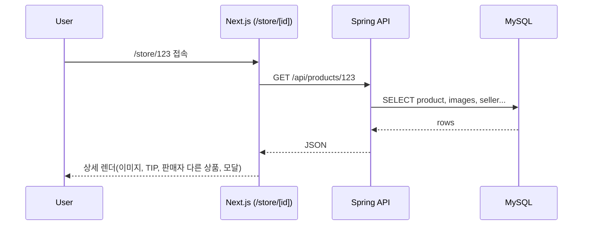
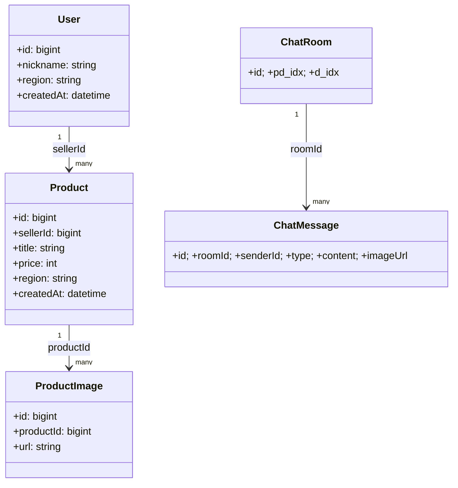

# 대파 마켓 (Daepa Market)

신선하고 안전한 중고거래 플랫폼 **대파(DAEPA)** 의 모노레포입니다.  
**Frontend (Next.js 15)** + **Backend (Spring Boot 3)** + **MySQL 8** + **Nginx** 를 **Docker Compose**로 묶어 개발/운영합니다.

> 본 README는 현재까지 진행한 구조/컴포넌트/흐름을 기준으로 작성되었습니다. 실제 파일명/경로가 다르면 README를 맞춰 수정하세요.

---

## ✨ 핵심 기능

- 홈/카테고리/상품상세/마이페이지
- 회원가입/약관동의(프론트 유효성, 라우팅/실검증 분리)
- 판매자 카드, 판매자의 다른 상품, 안전거래 TIP
- 신고/공유 모달, 구매/채팅 플로우(분리 설계)
- (백엔드) JPA + MyBatis 하이브리드, JWT 인증, 채팅 스키마

---

## 📂 폴더 구조

```text
daepa_test/
├─ frontend/                      # Next.js 15 앱
│  ├─ src/
│  │  ├─ app/
│  │  │  ├─ page.js              # 홈
│  │  │  ├─ layout.js            # 전역 레이아웃(Header/Footer 포함)
│  │  │  ├─ sing/                # (오탈자 가능) 가입/로그인 섹션
│  │  │  │  └─ join/
│  │  │  │     ├─ page.js        # 회원가입 폼
│  │  │  │     └─ agree/page.js  # 약관동의 (내용 + 체크 UI)
│  │  │  ├─ store/
│  │  │  │  └─ [id]/page.js      # 상품 상세 페이지
│  │  │  └─ mypage/page.js       # 마이페이지
│  │  ├─ components/
│  │  │  ├─ header.js
│  │  │  ├─ footer.js
│  │  │  ├─ bener.js             # 배너 (클라이언트 컴포넌트)
│  │  │  ├─ ItemGrid/ItemGrid.js # 목록 그리드
│  │  │  └─ ui/
│  │  │     ├─ SafetyTips/index.js
│  │  │     └─ ...
│  │  ├─ lib/
│  │  │  ├─ api.js               # REST 호출 래퍼(fetch/axios)
│  │  │  ├─ store.js             # 상태관리(Zustand)
│  │  │  └─ utils.js             # 공통 유틸(가격/날짜 포맷 등)
│  │  ├─ styles/ or app/**.module.css
│  │  └─ public/                 # 로고/파비콘/샘플 이미지
│  ├─ package.json
│  └─ Dockerfile
│
├─ backend/                       # Spring Boot 3.x
│  ├─ src/main/java/...           # API, Service, Repository
│  ├─ src/main/resources/
│  │  └─ application.yml
│  ├─ Dockerfile
│  └─ build.gradle or pom.xml
│
├─ backend/db/
│  ├─ conf.d/mysql.cnf
│  ├─ data/                       # MySQL 데이터 볼륨
│  └─ initdb.d/                   # 초기 스키마/DDL(SQL)
│
├─ conf/
│  └─ nginx.conf or default.conf  # Nginx 구성
│
├─ docker-compose.yml
└─ README.md
```

> `sing/join` → `sign/join` 로 폴더명을 통일하는 것을 권장합니다.

---

## 🧱 컴포넌트/라이브러리 역할 & 연결관계

### 전역 레이아웃
- `app/layout.js`  
  - **역할**: 전역 메타/폰트/스타일 + `<Header/>` `<Footer/>` 공통 렌더
  - **연결**: `components/header.js`, `components/footer.js`, `globals.css`

### 헤더/푸터
- `components/header.js`  
  - **역할**: 로고, 검색, 진입 링크(마이페이지/채팅/찜/판매하기)  
  - **연결**: `next/link`, MUI 아이콘(설치 필요)
- `components/footer.js`  
  - **역할**: 회사·사업자 정보, 약관/정책 링크, 브랜딩  
  - **연결**: CSS Module or 인라인 스타일, `public` 로고

### 배너/그리드
- `components/bener.js`  
  - **역할**: 메인 상단 배너(슬라이더) → **클라이언트 컴포넌트**  
  - **연결**: `swiper/react`, `swiper/css`, `Navigation`, `Autoplay`
- `components/ItemGrid/ItemGrid.js`  
  - **역할**: 목록 카드(이미지/제목/가격/지역/시간)  
  - **연결**: `lib/utils`(가격 포맷), `next/link`, 반응형 CSS

### 상품 상세
- `app/store/[id]/page.js`  
  - **역할**: 이미지 갤러리, 상세정보, 판매자 카드, **판매자의 다른 상품**, **안전거래 TIP**, 신고/공유 모달, 구매/채팅 버튼  
  - **연결/주의**:
    - `components/ui/SafetyTips` (CSS Module 경로/파일명 일치 필요)
    - `SellerOtherList`는 **클라이언트 컴포넌트**에서 이벤트 처리
    - 이미지 `onError` 핸들러는 서버 컴포넌트로 전달 금지(클라 분리)

### 회원가입/약관
- `app/sing/join/page.js`  
  - **역할**: 아이디/비번/닉네임 유효성(HTML5 + 커스텀)
- `app/sing/join/agree/page.js`  
  - **역할**: 약관 스크롤 박스 + 체크 UI(간격/여백 정돈)

### lib 계층
- `lib/api.js`  
  - **역할**: API 호출 공통 래퍼(기본 URL/헤더/에러처리, JSON 파싱)
- `lib/store.js`  
  - **역할**: Zustand 전역 상태(유저/찜/최근 본 상품 등)
- `lib/utils.js`  
  - **역할**: 금액/날짜 포맷, 이미지 플레이스홀더, 공통 상수

---

## 🔌 프런트 ↔ 백엔드 데이터 흐름

```mermaid
flowchart TD
  U[사용자] --> FE[Next.js 프론트]
  FE -->|REST| API[/lib/api - fetch/axios/]
  API --> BE[Spring Boot API]
  BE --> DB[(MySQL)]
  FE --> ST[Zustand store]
  FE --> H{클라이언트 컴포넌트?}
  H -->|YES| I[이벤트/상호작용]
  H -->|NO|  S[서버 컴포넌트(SSR/페칭)]
  FE <--> NX[Nginx Reverse Proxy]
```

### 상품 상세 시퀀스


### 데이터 모델(요약 ER)


---

## ⚙️ 백엔드 개요

- **레이어드 구조**: Controller → Service → Repository(JPA & MyBatis 병행)
- **주요 엔티티(예)**: `User`, `Product`, `ProductImage`, `Category`, `Deal`, `ChatRoom`, `ChatMessage`, `Favorite`, `Review`, `MannerScore` …
- **채팅 스키마(요약)**  
  - `chat_rooms(id, pd_idx, d_idx, created_at, updated_at)`  
  - `chat_messages(id, room_id, sender_id, message_type(TEXT/IMAGE/SYSTEM), content, image_url, created_at)`  
  - `chat_reads(room_id, user_id, last_read_message_id, last_read_at)`
- **인증**: JWT(/auth/login, /auth/refresh 예정)
- **이미지**: 정적 파일 or 외부 스토리지(S3 예정)

---

## 🚀 실행 방법

### 1) 환경 변수
`backend/.env` (예시)
```env
SPRING_DATASOURCE_URL=jdbc:mysql://mysql80:3306/my_db
SPRING_DATASOURCE_USERNAME=admin
SPRING_DATASOURCE_PASSWORD=1111
SPRING_JPA_PROPERTIES_HIBERNATE_DIALECT=org.hibernate.dialect.MySQL8Dialect
JWT_SECRET=your_jwt_secret
```

### 2) Docker Compose (요약)
```yaml
services:
  mysql80:
    image: mysql:8
    container_name: mysql80
    env_file: ./backend/.env
    volumes:
      - ./backend/db/conf.d/mysql.cnf:/etc/mysql/conf.d/mysql.cnf
      - ./backend/db/data:/var/lib/mysql
      - ./backend/db/initdb.d:/docker-entrypoint-initdb.d
    networks: [sist_net]
    ports: ["3307:3306"]
    restart: always

  backend:
    build: ./backend
    container_name: backend
    depends_on: [mysql80]
    environment:
      - SPRING_DATASOURCE_URL=jdbc:mysql://mysql80:3306/my_db
      - SPRING_DATASOURCE_USERNAME=admin
      - SPRING_DATASOURCE_PASSWORD=1111
      - SPRING_JPA_PROPERTIES_HIBERNATE_DIALECT=org.hibernate.dialect.MySQL8Dialect
    ports: ["8080:8080"]
    networks: [sist_net]

  frontend:
    build: ./frontend
    container_name: frontend
    depends_on: [backend]
    ports: ["3000:3000"]
    networks: [sist_net]

  nginx:
    image: nginx:latest
    container_name: nginx
    depends_on: [frontend]
    volumes:
      - ./conf/nginx.conf:/etc/nginx/nginx.conf:ro
    ports: ["80:80"]
    networks: [sist_net]
    restart: always

networks:
  sist_net:
    driver: bridge
```

### 3) 로컬 개발
```bash
# Frontend
cd frontend
npm i
npm run dev

# Backend
cd backend
# IDE에서 Spring Boot 실행 or
./gradlew bootRun   # 또는 mvn spring-boot:run
```

---

## 🧩 의존성 & 설치

```bash
# Next.js 프론트 기본
npm i next react react-dom

# 상태/슬라이더/UI
npm i zustand swiper

# MUI (아이콘 포함)
npm i @mui/material @emotion/react @emotion/styled @mui/icons-material

# shadcn/ui를 선택한다면 (프로젝트 정책에 따라)
# npx shadcn@latest init
```

---

## 🧪 체크리스트 / 트러블슈팅

- **Client/Server 분리**: 이벤트 핸들러 필요 시 파일 최상단에 `"use client"`.
- **CSS Module 경로**: `import s from "./SafetyTips.module.css"` 등 **정확한 경로/파일명**.
- **MUI 아이콘 미설치 오류**: `@mui/icons-material` 설치 필요.
- **이미지 onError**: 서버 컴포넌트에 전달 금지 → 클라이언트 컴포넌트로 분리.
- **경로 별칭**: `@/components/...` 가 현재 프로젝트의 `src`를 가리키는지 `jsconfig.json/tsconfig.json` 확인.
- **Swiper**: `import 'swiper/css'` 포함, 필요한 모듈만 등록(`Navigation`, `Autoplay` 등).

---

## 🔀 브랜치 전략 & 컨벤션

- 브랜치: `main`(배포) / `develop`(통합) / `feature/*`
- 커밋: `feat:`, `fix:`, `docs:`, `refactor:`, `style:`, `test:`, `chore:`
- PR: 변경 요약 + 스크린샷 + 테스트 방법 포함, 최소 1인 리뷰

---

## 🗺️ 로드맵

- [ ] 회원가입/로그인 실제 API 연동(JWT)
- [ ] 상품 업로드/수정/삭제
- [ ] 채팅(WebSocket) 1:1 개설/읽음표시
- [ ] 알림(거래 상태, 채팅 수신)
- [ ] 이미지 업로드(S3 등)
- [ ] SEO/OG 태그/사이트맵
- [ ] CI/CD(GitHub Actions + Docker Registry)

---

## 📎 부록: 자동 문서화 팁

```bash
# (선택) 프로젝트 트리 캡처
npx --yes tree-cli -a -I "node_modules|.git|.next|out" > PROJECT_TREE.txt

# (선택) 프론트 의존성 목록
cd frontend && npm ls --depth=0 > ../DEPENDENCIES_FRONTEND.txt
```
